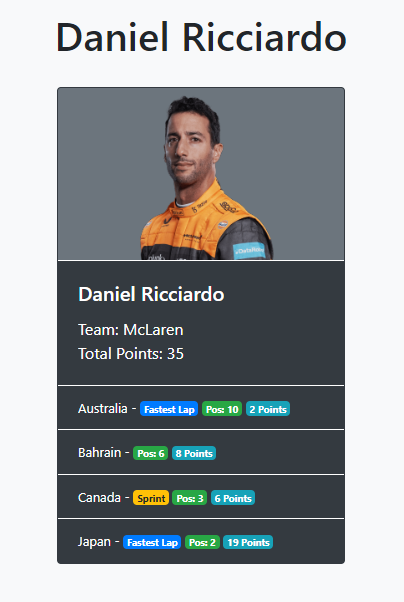

# Live Project 1
## Introduction
During my software development course at the Tech Academy, I participated in a 2-week code sprint during which I was tasked to create a Django MVT web app with basic CRUD functionality. In addition to building the back end of the app, I designed the front end using Django template inheritance, block tags, and template tags. The entire app was integrated into a larger website and I used Git as my VCS to write, test, and ultimately merge my code into the master branch. During the sprint, I worked with a team of other students and instructors, using Agile methodologies to manage the project as a whole.

Below are some more in-depth descriptions of what I learned and did during this live project.

## Back End Stories
I chose to develop a Formula 1 related app that would allow users to enter race results into a database, view those results all at once or filtered for a single driver or team, update those results if any changes needed to be made, and delete results if necessary.

### Django Modelform for Editing Results
For one user story, I was asked to use a Django Modelform to allow users to view a result and edit it if desired. I wanted to use the same views.py function to display the current result and to handle any edits made to that result by the user. I was able to do that by checking the HTTP request method. I also needed to validate the form by checking to make sure it didn't duplicate an already existing result, and calculate the new point total.

```
def edit_result(request, pk):
    obj = get_object_or_404(Result, id=pk)

    form = ResultForm(request.POST or None, instance = obj)
    context = {'form': form}

    if request.method == 'POST':
        if form.is_valid():
            result = form.save(commit=False)

            # GENERATE DRIVER_RACE_KEY AND ASSIGN IT
            key = f"{result.Race} - {result.Race_Type} - {result.Driver_Name}"
            result.Driver_Race_Key = key

            # USE BUSINESS LOGIC TO CALCULATE POINT TOTAL
            if result.Finishing_Position == 'DNF':
                result.Points_Earned = 0
            else:
                pos = int(result.Finishing_Position)

                #CALCULATE POINTS FOR A FEATURE RACE
                if result.Race_Type == 'Feature Race':
                    if pos <= 10:
                        points = POINTS_PER_POSITION_FEATURE[pos]
                        if result.Fastest_Lap == True:
                            points = points + 1
                        result.Points_Earned = points
                    else:
                        result.Points_Earned = 0

                #CALCULATE POINTS FOR A SPRINT RACE
                else:
                    if pos <= 8:
                        points = POINTS_PER_POSITION_SPRINT[pos]
                        result.Points_Earned = points
                    else:
                        result.Points_Earned = 0
            try:
                result.save()
                messages.success(request, "Successfully updated the race result.")
                return redirect('race_results')
            
            # THROW AN ERROR IF A RESULT ALREADY EXISTS FOR THIS DRIVER-RACE COMBO
            except IntegrityError as e:
                messages.error(request, f"{result.Driver_Name} already has a result recorded for {result.Race} - {result.Race_Type}")
                return redirect('edit_result', pk=pk)
            
        # THROW AN ERROR IF THE FORM ISN'T VALID
        else:
            messages.error(request, "The race result was not updated successfully.")

            context = {'form': form}

            return render(request, "Formula1/Formula1_editResult.html", context)
    
    # SEND THE USER TO THE EDITRESULT PAGE IF THEY DIDN'T COME HERE FROM FORM SUBMISSION (METHOD != POST)
    else:
        return render(request, "Formula1/Formula1_editResult.html", context)
```

### Render Team Details Page
I created a details page for drivers and one for teams, so that when a user clicks on a driver/team, they'll be taken to a page where all information for that driver/team will be displayed. This was a little more complicated for teams because I needed to use the results model (which may contain many different race results for one driver), to create a list of a team's drivers without duplicates, and combine those driver's points totals into one team total for each race, as well as a full season total. Learning the best way to pass all of that info to the template and then access it within the template was challenging, but fun.

```
def team_details(request, value):
    data = Result.results.all().filter(Current_Team=value).order_by('Race', 'Race_Type')
    drivers = []
    races = {}
    total = 0

    for result in data:

        # ADD RACE POINTS TO TEAM TOTAL
        total += result.Points_Earned

        # ADD DRIVER TO TEAM DRIVER LIST
        if result.Driver_Name not in drivers:
            drivers.append(result.Driver_Name)

        #CREATE DETAILS LIST TO BE NESTED IN A DICTIONARY FOR EASY ACCES WITHIN TEMPLATE
        race_details = [result.Race, result.Race_Type, int(result.Points_Earned)]
        race_specific = "{} - {}".format(result.Race, result.Race_Type)

        #COMBINE POINT TOTALS FOR DIFFERENT DRIVERS IN THE SAME RACE INTO TEAM TOTAL
        if race_specific not in races:
            races[race_specific] = race_details
        else:
            races[race_specific][2] += int(result.Points_Earned)

    img = TEAM_IMAGES[value]
    summary = [value, drivers, int(total), img]
    context = {
        'summary': summary,
        'data': data,
        'races': races
    }
    return render(request, "Formula1/Formula1_teamDetails.html", context)
```
## Front End Stories
I used Bootstrap 4 and minimal custom CSS to style my app. Each HTML page used template inheritance to extend from a base template, include a navbar and footer, and place individualized content between block tags. Learning to use template tags to access data sent from the view, including iterating through nested lists and dictionaries, was the biggest challenge of this part of the project.

Here's an example of how the content for the driver details page was generated and what it looks like:

```




Formula 1

{{ summary.0 }}



<div class="card mx-auto text-dark bg-secondary mb-3 border border-dark" style="width: 18rem;">
    
    <div class="card-body text-white bg-dark border-top border-white">
        <h5 class="card-title">{{ summary.0 }}</h5>
        <p class="card-text">Team: {{ summary.1 }}<br>Total Points: {{ summary.2 }}</p>
    </div>
    <ul class="list-group list-group-flush text-white bg-dark">
        
            <li class="list-group-item text-white bg-dark border-top border-white race-name">
                {{ result.Race }} -
                
                    <span class="badge badge-warning">Sprint</span>
                
                    
                        <span class="badge badge-primary">Fastest Lap</span>
                    
                
                <span class="badge badge-success">Pos: {{ result.Finishing_Position }}</span>
                <span class="badge badge-info">{{ result.Points_Earned }} Points</span>
            </li>
        
    </ul>
</div>



```
